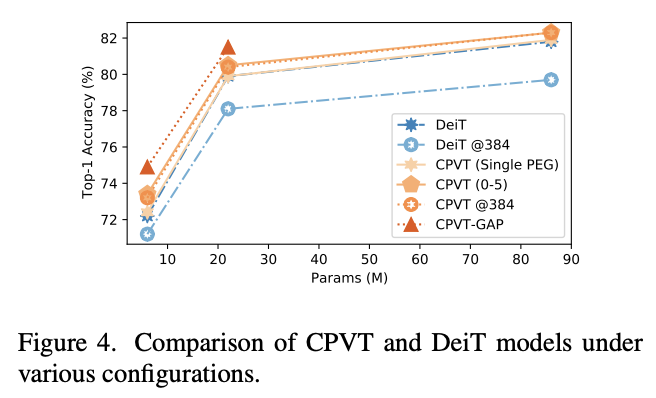
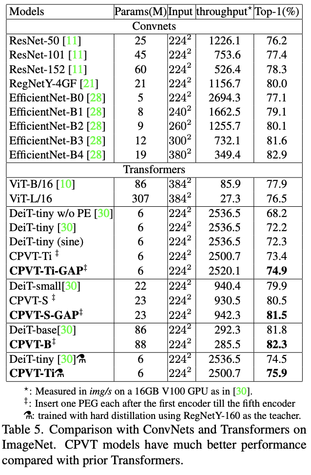

# CPVT ([arxiv](https://arxiv.org/abs/2102.10882))

We propose a conditional positional encoding (CPE) scheme for vision Transformers. Unlike previous fixed or learnable positional encodings, which are pre-defined and independent of input tokens, CPE is dynamically generated and conditioned on the local neighborhood of the input tokens. As a result, CPE can easily generalize to the input sequences that are longer than what the model has ever seen during training. Besides, CPE can keep the desired translation-invariance in the image classification task, resulting in improved classification accuracy. CPE can be effortlessly implemented with a simple Position Encoding Generator (PEG), and it can be seamlessly incorporated into the current Transformer framework. Built on PEG, we present Conditional Position encoding Vision Transformer (CPVT). We demonstrate that CPVT has visually similar attention maps compared to those with learned positional encodings. Benefit from the conditional positional encoding scheme, we obtain state-of-the-art results on the ImageNet classification task compared with vision Transformers to date

Code will be available soon.

## 招聘

团队正在招聘2022届校招实习生。方向涉及计算机视觉、AutoML/NAS。感兴趣的同学请发简历至 chuxiangxiang@meituan.com
